<table>
<tr>
<td valign="top"></td>
<td valign="top"></td>
</tr>
</table>

## Eshan Sengupta

**Engineer**

 

---

## 💫 About Me

🎓 Master's student in Informatics Sciences @ Vilnius Tech, Lithuania 
🦾 Looking to collaborate on machine learning & computer vision 
📄 Published 14+ research papers with Springer & IEEE 
💡 Ask me about anything — I promise I'll never throw an `exception` 
☢️ Fun fact: AOT \| S3 \| EP 16 \| 18.15

## 💻 Tech Stack

                 

## 📚 Publications

14 peer-reviewed papers published in **Springer** & **IEEE** journals, spanning AI, computer vision, IoT-fog systems, and smart surveillance — co-authored with researchers at Guru Nanak Dev University.

## 🏆 Highlights

- 🥇 Full ICCR scholarship (Bangladesh Scholarship Scheme) for B.Tech at GNDU, Amritsar
- 🧑‍💼 Microsoft Learn Student Ambassador — reached 2nd highest milestone
- 👥 Chairperson, GFG Student Chapter GNDU (7 leads, 50+ volunteers)
- ☁️ Google Cloud Career Practitioner — Tier 3, 35+ certifications
- 🎨 Painter — oil pastels, acrylics, sketches; exhibited in two group shows
